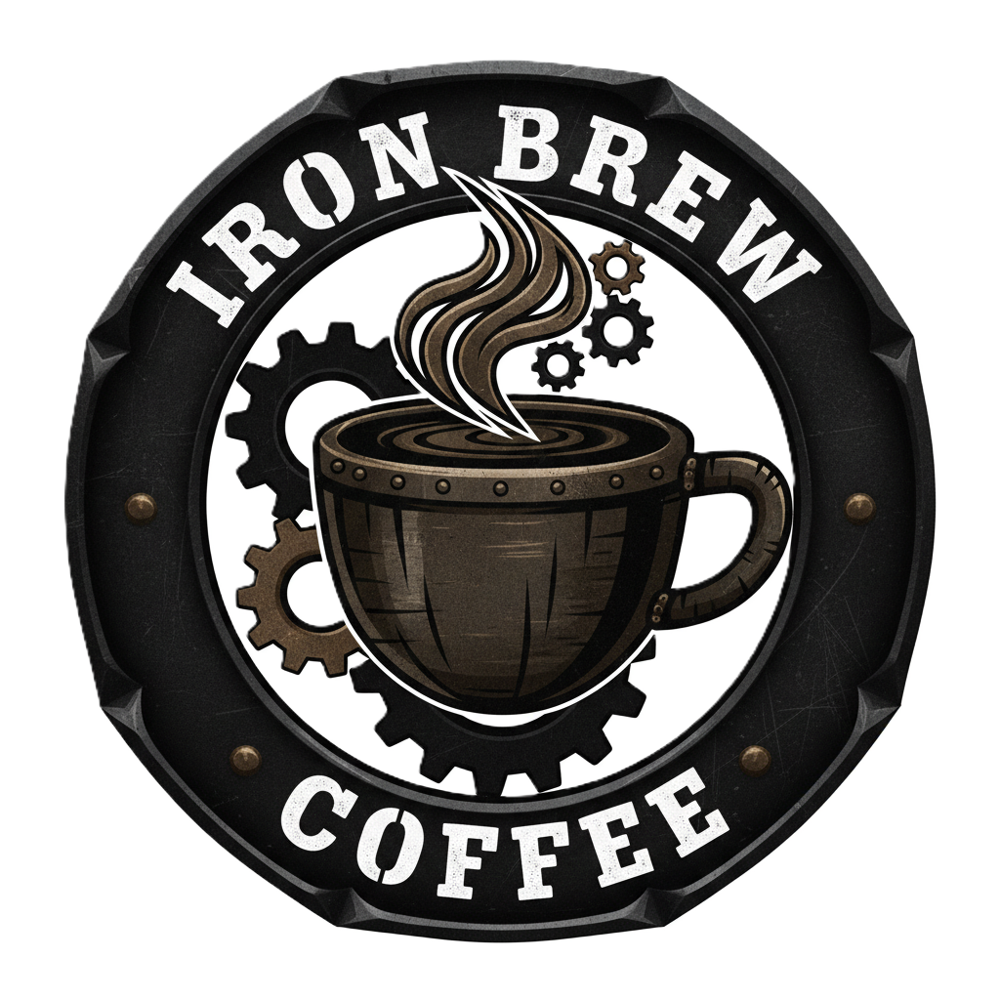

<!-- PROJECT LOGO -->
<div align="center">
  <a href="https://github.com/Ang-Kimsor/CafeShop">
    
  </a>

  <h1 align="center">☕️ Cafe Shop ☕️</h1>

  <p align="center">
    This website is made for a cozy little café that loves serving great coffee and tasty treats.  
    You can check out the full menu with all the drinks and snacks they offer, including some seasonal specials.  
    It’s easy to see what’s fresh that day and plan your visit accordingly.  
    <br /><br />
    <a href="https://cafe-shop-liard.vercel.app/">View Demo</a>
  </p>
</div>

<!-- TABLE OF CONTENTS -->
<details>
  <summary>Table of Contents 📑</summary> 
  <ol>
    <li>
      <a href="#about-the-project">About The Project</a> 📖
      <ul>
        <li><a href="#built-with">Built With 🛠️</a></li>
      </ul>
    </li>
    <li>
      <a href="#getting-started">Getting Started 🚀</a>
      <ul>
        <li><a href="#prerequisites">Prerequisites ✅</a></li>
        <li><a href="#installation">Installation 💾</a></li>
      </ul>
    </li>
    <li><a href="#folder">Folder Structure 🧑‍💻</a></li>
    <li><a href="#usage">Usage 🧑‍💻</a></li>
    <li><a href="#contributors">Contributors 🤝</a></li>
    <li><a href="#contact">Contact 📬</a></li>
    <li><a href="#acknowledgments">Acknowledgments 🙏</a></li>
  </ol>
</details>

<!-- ABOUT THE PROJECT -->
<p id="about-the-project">
</p>

## About The Project 📖

[![Project Screenshot][project-screenshot]]()

The site looks good on any device, whether you’re on your phone or a computer.  
You can even make a reservation or send a message directly through the contact form.  
There’s a map to help you find the café without any hassle.  
Pictures of the café’s warm and inviting space give you a feel for the vibe before you go.  
Follow their social media to keep up with events and new menu items.  
The site is simple and accessible, so everyone can enjoy it.  
It’s perfect if you want to show off a local café or just practice building a friendly, user-focused website.

<p id="built-with">
</p>

### Tools & Technologies 🛠️

[![HTML][HTML]][HTML-url]
[![CSS][CSS]][CSS-url]
[![TailwindCSS][TailwindCSS]][TailwindCSS-url]
[![FontAwesome][FontAwesome]][FontAwesome-url]
[![JS][JS]][JS-url]
[![AOS][AOS]][AOS-url]
[![React][React.js]][React-url]
[![ReactRouter][ReactRouter.js]][ReactRouter-url]

<!-- GETTING STARTED -->
<p id="getting-started">
</p>

## Getting Started 🚀

Follow these steps to run the Cafe Shop locally for development or testing.

<p id="prerequisites">
</p>

### Prerequisites ✅

- **[Node.js](https://nodejs.org/)** (version 14+ recommended)
- **npm** or **yarn**
- Modern browser (Chrome, Firefox, Edge, etc.)

<p id="installation">
</p>

### Installation 💾

1. Clone the repository

   ```sh
    git clone https://github.com/Ang-Kimsor/CafeShop.git
   ```

2. Open CafeShop Project

   ```sh
    cd CafeShop
   ```

3. Install dependencies

   - Using npm:

     ```sh
       npm install
     ```

   - or using yarn:

     ```sh
       yarn install
     ```

4. Start the development server

   - Using npm:

     ```sh
       npm run dev
     ```

   - or using yarn:

     ```sh
       yarn start
     ```

5. Open your browser and navigate to localhost url to see the app running.

<p id="folder">
</p>

## Folders Structure 📂

### Here is CafeShop folders structure:

```sh

├── /src                        # Source code files

│   ├── /assets                 # Images, fonts, and other media assets

│   ├── /component              # Reusable React components or UI elements

│   ├── /data                   # Static data for whole website (Product, Footer, Navbar, ...)

│   ├── /layout                 # Layout components

│   ├── /pages                  # Page-level components or views

│   └── App.jsx                 # Static route component of whole website

│   └── main.jsx                # Main application component

│

├── package.json                # Project metadata and dependencies

├── README.md                   # Project documentation

└── .gitignore                  # Files and folders to ignore in git
```

<p id="usage">
</p>

<!-- USAGE EXAMPLES -->

## Usage 🧑‍💻

The site looks good on any device, whether you’re on your phone or a computer.  
You can even make a reservation or send a message directly through the contact form.

<p id="contributors">
</p>

## Contributors 🤝

Contributions are welcome! Whether it’s fixing bugs, adding new features, or improving documentation, feel free to fork the repository and submit a pull request. Please open an issue first for major changes to discuss what you would like to contribute.

<a href="https://github.com/Ang-Kimsor/CafeShop/graphs/contributors">
  
</a>

<p id="contact">
</p>

<!-- CONTACT -->

## Contact 📬

**Ang Kimsor** - [Telegram](https://t.me/Thirtieth_October) - [angkimsor@gmail.com](mailto:angkimsor@gmail.com) - **Call Me ☎️ +85587932289**

Project Link: [https://github.com/Ang-Kimsor/CafeShop](https://github.com/Ang-Kimsor/CafeShop)

<p id="acknowledgments">
</p>

<!-- ACKNOWLEDGMENTS -->

## Acknowledgements 🙏

- Thanks to the ReactJS community for the powerful tools and support.
- Open-source projects and tutorials that guided this project’s development.
- [Shields.io](https://shields.io/) for awesome badges used in this README.
- Icons from [Font Awesome](https://fontawesome.com/) and other free icon libraries.
- Special thanks to friends, mentors, or contributors who provided feedback or assistance.

<!-- MARKDOWN LINKS & IMAGES -->

[project-screenshot]: src/assets/screenshot.png
[HTML]: https://img.shields.io/badge/HTML-20232A?style=for-the-badge&logo=html5&logoColor=E34F26
[HTML-url]: https://www.w3schools.com/html/
[CSS]: https://img.shields.io/badge/CSS-20232A?style=for-the-badge&logo=css&logoColor=1572B6
[CSS-url]: https://www.w3schools.com/css/
[JS]: https://img.shields.io/badge/javascript-20232A?style=for-the-badge&logo=javascript&logoColor=F7DF1E
[JS-url]: https://www.w3schools.com/js/
[FontAwesome]: https://img.shields.io/badge/FontAwesome-20232A?style=for-the-badge&logo=font-awesome&logoColor=#538DD7
[FontAwesome-url]: https://fontawesome.com/
[TailwindCSS]: https://img.shields.io/badge/Tailwind_CSS-20232A?style=for-the-badge&logo=tailwind-css&logoColor=38B2AC
[TailwindCSS-url]: https://tailwindcss.com/
[React.js]: https://img.shields.io/badge/React-20232A?style=for-the-badge&logo=react&logoColor=61DAFB
[React-url]: https://reactjs.org/
[ReactRouter.js]: https://img.shields.io/badge/ReactRouter-20232A?style=for-the-badge&logo=react&logoColor=61DAFB
[ReactRouter-url]: https://reactrouter.com/
[AOS]: https://img.shields.io/badge/AOS-20232A?style=for-the-badge&logo=css&logoColor=1572B6
[AOS-url]: https://michalsnik.github.io/aos/
